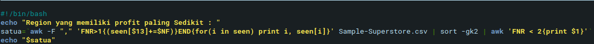
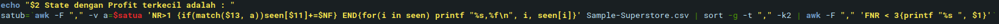
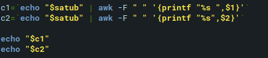
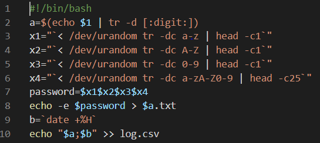
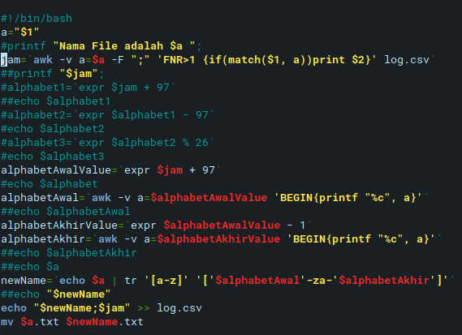
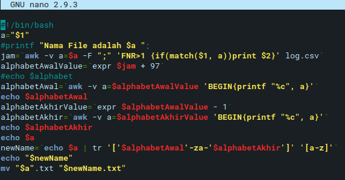

# SoalShiftSISOP20_modul1_T11
## Nomor 1
### Satu A

1. `awk -F ","`  --> dengan , sebagai separator daripada column yang ada di csv.
2. `FNR > 1 ` --> yang berartikan mulai dari Row ke 2, dikarenakan row 1 merupakan judul seperti Row Id, Product name, dll
3. `seen[$13]+=$NF` --> yang berartikan bahwa variable seen, yang memiliki index $13 (Antara lain West, South,Central,East) dan +=NF
                      yang digunakan untuk menjumlahkan semua profit
4. `END{for (i in seen) print i, print seen[i]}` --> Setelah proses awk selesai (END) maka akan dijalankan perintah untuk melakukan perintah print i yaitu nama dari Region, beserta profit tiap tiap Region
5. `Sample-Superstore.csv` --> Nama File
6. `sort -gk2` --> Sort secara angka generic, pada kolom ke 2, yaitu kolom proft,
7. `awk FNR < 2{print $1}` --> Melakukan proses print nama Region yang berada di posisi teratas (Profit Terkecil)

### Satu B

1. `awk -F ","` --> separator ","
2. `-v a=$satua` --> Menyimpan nilai satua, ke dalam variable a
3. `NR>1` --> Start dari row ke 2
4. `if(match($13, a)seen[$11]+=NF)END` --> Jika Kolom ke 13, match dengan variable a (NAMA REGION) maka buat array dengan index state, dan tambahkan profit dari tiap state,
5. `for(i in seen) printf "%s","%f"\n,i , seen[i]` --> Untuk tiap i (State) print state dan juga jumlahlahnya
6. `Sample-Superstore.csv` --> Nama File
7. `sort -g -t "," -k2` --> Sort berdasarkan generic number, dan juga dengan separator "," (Dikarenakan pada nomor 5 di print dengan separator "," dan dan juga sort pada kolom ke 2(setelah di separate))
8. `awk -F "," 'FNR < 3 {printf "%s ", $1}'` --> Print 2 nama teratas pada data yang telah disort

### satu C

1. `c1= echo "$satub" | awk -F " " '{printf "%s ",$1}'` --> Gunakan output echo satub dan Separate dengan separator " ", kemudian ambil $1
2. `c1= echo "$satub" | awk -F " " '{printf "%s ",$2}'` --> Gunakan output echo satub dan Separate dengan separator " ", kemudian ambil $2

1. `echo -e "satuc1satuc2"` --> Menggabungkan hasil echo var satuc1 dan satuc2
2. `awk -F "^"'{printf "%s%f\\n\n",$0,$1}'` --> Melakukan separasi dengan '^' kemudian melakukan Print
3. `sort -g -t "^" -k2` --> Melakukan sort dengan generic number dengan separator "^" pada field ke 2
4. `awk -F "^" 'NR < 11 {printf %s\n,$1}'` --> Melakukan print 10 nama produk dengan profit terkecil 

## NOMOR 2
### DIANJURKAN UNTUK MEMBUAT FILE BARU TERLEBIH DAHULU DENGAN URUTAN
1. bash soal2.sh *NAMAFILE*
2. bash soal2_enkripsi.sh *NAMAFILE*
3. bash soal2_dekripsi.sh *NAMAFILE YANG TELAH DI ENKRIPSI*

### Dua a & b

1. `a=$(echo $1 | tr -d [:digit:])` --> Deklarasi Variable a yang berisikan echo $1 yang telah dihapuskan digit dengan function -tr(translate) -d [:digit:]
2. `< /dev/urandom tr -dc A-Za-z0-9 | head -c28  > $a.txt` --> Function random dengan parameter (batas hanya alphabet dan angka) sebanyak 28 karakter dan dimasukan ke file $a.txt
3. `b = date +%H ` --> Variable b adalah jam waktu file itu dibuat
4. `echo "$a;$b" >> log.csv` --> Memasukkan nama File ($a) dan ($b) kedalam suatu file csv yaitu log.csv (sebagai database seluruh file yang dibentuk dan jamnnya) DENGAN Separator ";"

### Dua C

1. `a="$1"` --> Variable a adalah Argumen yang diinputkan`
2. `jam=awk -v a=$a -F ";" 'FNR>1 {if(match($1, a))print $2}' log.csv` --> Variable Jam diambil dari database (log.csv) dengan key yaitu nama file itu sendiri
3. `alphabetAwalValue= expr $jam + 97` --> Deklarsi variable awal adalah huruf ascii 'a' + jam
4. `alphabetAwal=awk -v a=$alphabetAwalValue 'BEGIN{printf "%c", a}'` --> Mendapatkan Karakter dari Value ascii
5. `alphabetAkhirValue= expr $alphabetAwalValue - 1` --> Mendapatkan Value dari karakter Ascii, satu huruf sebelum alphabet alphabetAwal
6. `alphabetAkhir= awk -v a=$alphabetAkhirValue 'BEGIN{printf "%c", a}'` --> Mendapatkan Karakternya
7. `newName= echo $a | tr '[a-z]' '['$alphabetAwal'-za-'$alphabetAkhir']'` -->< Proses Enkripsi, nama file yang tersimpan dalam $a akan digantikan, Contoh : jam = 3, maka tr '[a-z]' '[d-za-c]' dimana ascii value dari d = a + 3
8. `echo "$newName;$jam" >> log.csv` --> Untuk membantu proses dekripsi kembali maka disimpan nama file yang telah diencrypt beserta jamnya (jam file dibuat)
9. `mv $a.txt $newName.txt` --> Proses Rename FILE

### Dua D

1. `a="$1"` --> Variable a adalah Argumen yang diinputkan`
2. `jam=awk -v a=$a -F ";" 'FNR>1 {if(match($1, a))print $2}' log.csv` --> Variable Jam diambil dari database (log.csv) dengan key yaitu nama file itu sendiri
3. `alphabetAwalValue= expr $jam + 97` --> Deklarsi variable awal adalah huruf ascii 'a' + jam
4. `alphabetAwal=awk -v a=$alphabetAwalValue 'BEGIN{printf "%c", a}'` --> Mendapatkan Karakter dari Value ascii
5. `alphabetAkhirValue= expr $alphabetAwalValue - 1` --> Mendapatkan Value dari karakter Ascii, satu huruf sebelum alphabet alphabetAwal
6. `alphabetAkhir= awk -v a=$alphabetAkhirValue 'BEGIN{printf "%c", a}'` --> Mendapatkan Karakternya
7. `newName= echo $a | tr '['$alphabetAwal'-za-'$alphabetAkhir']' ['a-z'] ` -->  Proses Dekripsi, nama file yang tersimpan dalam $a akan digantikan, Contoh : jam = 3, maka tr '[d-za-c]' '[a-z]' dimana ascii value dari d = a + 3
8. `echo "$newName;$jam" >> log.csv` --> Untuk membantu proses dekripsi kembali maka disimpan nama file yang telah diencrypt beserta jamnya (jam file dibuat)
9. `mv $a.txt $newName.txt` --> Proses Rename FILE
